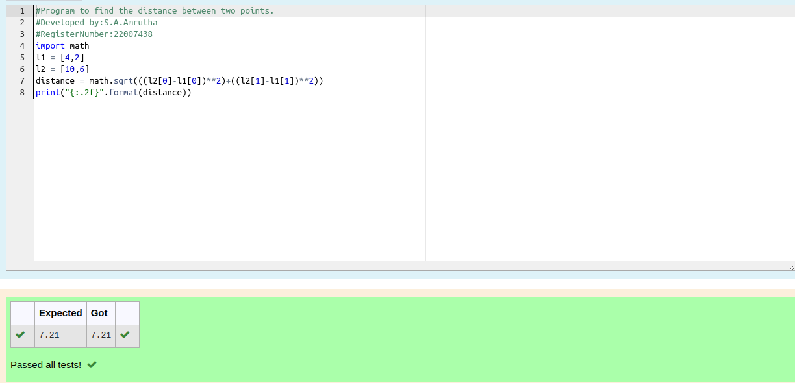

# DISTANCE-BETWEEN-TWO-POINTS

## AIM:
To write a python program to find the distance two 2 points

## ALGORITHM:

### Step 1:
Get the two values from the user
### Step 2: 
Assign the value of second variable to a temporary variable 
### Step 3: 
Substitute the values in the distance formula  
### Step 4:
Assign the value in temporary variable to first variabe 
### Step 5: 
Print both the values it would be interchanged
### Step 6:
End the program
### PROGRAM:
```python
#Program to find the distance between two points.
#Developed by:S.A.Amrutha 
#RegisterNumber:22007438
import math
l1 = [4,2]
l2 = [10,6]
distance = math.sqrt(((l2[0]-l1[0])**2)+((l2[1]-l1[1])**2))
print("{:.2f}".format(distance))
```  


### OUTPUT:



### RESULT:
